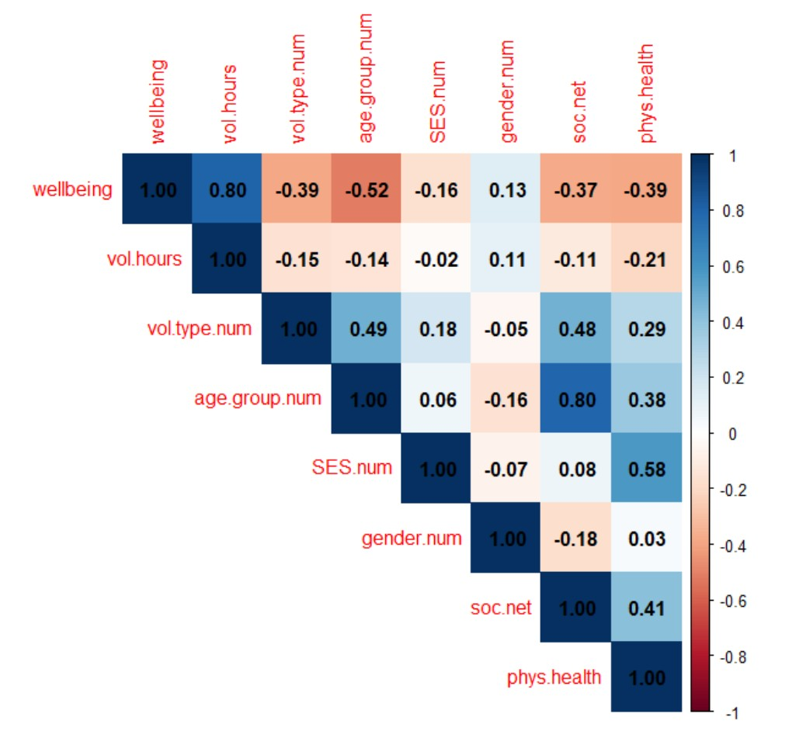

```{r setup, include=FALSE}
knitr::opts_chunk$set(echo = TRUE)
```

## Instructions

In the bottom right window, click on the file titled `CaseStudy3_Instructions.pdf`. Thoroughly read through the background and assignment instructions in order to complete the case study below. We encourage you to work on this assignment with a partner, but only active lab approach students may submit their work in pairs.

**Note:** only *active* lab approach students may submit case study assignments with a partner. Your partner must be in the same lab section - and you both must be in attendance during the corresponding lab session. Failure to adhere to these rules will result in a penalty applied to your case study score. *Students that correctly submit as a team will receive 5 points of extra credit towards their final case study score.*


\newpage


## Data

The `volunteer` dataset contains responses from n = 100 randomly selected members of VolunteerMatch, a national organization that focuses on connecting individuals with volunteer opportunities in their local communities. Each individual sampled volunteered at least once during the previous calendar year (2024). Although VolunteerMatch works to find volunteering opportunities for people of all ages, for the purposes of this assignment, we have restricted the data to volunteers who were college students and volunteers who were retirees. The variables recorded for these individuals include:

1. `wellbeing`: self-reported well-being, measured on a scale from 0-100, with higher values indicating higher overall psychological well-being 
2. `vol.hours`: the total number of hours spent volunteering in 2024
3. `vol.type`: an indicator of whether the individual’s volunteering activities primarily addressed social causes (e.g., volunteering at a soup kitchen or safe house) or environmental causes (e.g., cleaning up trash in a community park)
4. `age.group`: an indicator of whether the volunteer was a college student or a retiree
5. `SES`: a variable indicating the volunteer’s current socioeconomic status (low, medium, high), based on household income
6. `gender`: an indicator of the volunteer’s self-reported gender (female, male)
7. `soc.net`: a variable describing the strength of the volunteer’s social network, recorded as the average number of social interactions the volunteer had per week in the previous calendar year
8. `phys.health`: a score describing the volunteer’s overall health for their age, measured on a scale from 0-10, with higher values indicating better health


Use the following code chunks to read in and preview the data set. 

```{r read_data}
load("volunteer.Rda")
```

```{r preview_data}
head(volunteer)
```

And be sure to load in any necessary packages!

```{r load_packages, warning = FALSE}
library(ggplot2)
```


\newpage


## Task

Your goal is to build a series of regression models that estimate the overall relationship between an individual’s well-being (wellbeing) and the number of hours they commit to volunteer work (vol.hours). In developing your models, you will demonstrate what you’ve learned about simple and multiple linear regression by evaluating the fit of the models you estimate and discussing what factors are important to consider when analyzing how volunteering relates to a person’s psychological well-being. Your analysis and written report will include the following main components:

1. Simple Linear Regression Analysis: Create a simple linear regression model (Model A) that predicts an individual’s self-reported well-being (wellbeing) using only the number of hours spent volunteering (vol.hours). Use the results of this model to run a population-level test of linear association and construct a confidence interval that estimates the true but unknown population-level slope.

2. Multiple Linear Regression Analyses: Add additional predictors to your initial model to create three multiple linear regression models (Model B, C, and D). These models should satisfy the following criteria:

    - Model B should include vol.hours and at least one additional quantitative predictor. This model should not include any categorical predictors, nor interactions.

    - Model C should include vol.hours and at least one additional quantitative predictor. This model’s set of predictors should differ from the previous model. This model should not include any categorical predictors, nor interactions. 

    - Model D should include vol.hours and one categorical predictor. This model should include an interaction between vol.hours and your categorical predictor. This model should not include any additional quantitative predictors. 

3. Discussion: First, summarize your findings from (1). Then, explain how you selected additional predictors for the multiple linear regression models you created in (2). Summarize your findings from (2) and compare the results to (1). Provide a conclusion regarding whether the number of hours spent volunteering is linearly associated with an individual’s well-being, and whether additional predictors influence this association.

These components should comprise a written report that demonstrates your ability to interpret the results of a regression model and your understanding of how to select helpful predictors.


\newpage


## Correlogram

A correlogram of the quantitative variables can be found below. To see an enlarged image of the correlogram, knit the document to a PDF! 




\newpage

## Analysis - Simple Linear Regression Model

Use the following code chunks to complete the first data analysis task.

Create a simple linear regression model (ModelA) that predicts an individual’s self-reported well-being (`wellbeing`) using only the number of hours spent volunteering (`vol.hours`). Report the summary results of this model. Create a scatterplot that visualizes the estimated model. Create a 95% confidence interval for the population-level slope. 

```{r}

```


```{r}

```


```{r}

```


```{r}

```


\newpage

## Analysis - Multiple Linear Regression Models

Use the following code chunks to complete the second data analysis task.

Use the provided correlogram (above) to determine which explanatory variable(s) might also assist in predicting an individual’s self-reported well-being (`wellbeing`). Create two multiple linear regression models (ModelB and ModelC) that each contain `vol.hours` and at least one additional quantitative predictor. Report the summary results of these models. You do not need to provide graphical representations in this section.

```{r}

```


```{r}

```


```{r}

```


```{r}

```


\newpage

## Analysis - Multiple Linear Regression Model with an Interaction

Use the following code chunks to complete the third data analysis task.

Create one last multiple linear regression model (ModelD) that contains `vol.hours` and one categorical predictor. This model should include an interaction between `vol.hours` and your categorical predictor. Report the summary results of this model. Create a scatterplot that visualizes the estimated interaction.

```{r}

```


```{r}

```


```{r}

```


\newpage

## Report

## Introduction and Simple Linear Regression Model

Replace this text with your first paragraph...

Replace this text with your second paragraph...


\newpage


## Multiple Linear Regression Models

Replace this text with your first paragraph...

Replace this text with your second paragraph...


\newpage

## Multiple Linear Regression Model with an Interaction and Conclusion

Replace this text with your first paragraph...

Replace this text with your second paragraph...


\newpage

## Word Count

Self-report the word count of your report by following the steps below:

1. Highlight the text in your "Report" section above (do not highlight any text from the coding section of this document)
2. In the top toolbar, click Edit > Word Count
3. Report the value of "Selected words" at the *top* of this document (below the title field and above the authors field)


***


## Submission Instructions

Carefully follow the instructions below to properly submit your completed work.

1. At the top of the document, updated the `author` field (in quotes!). *If you are submitting with a partner*, please include their name in the `author` field as well. Note: both names must appear in the same set of quotes (e.g., "John Smith and Jane Doe"). Do not change any of the other fields (title, date, output) at the top of the document. 

2. Click the **Knit** button. (*If you receive an error, check out the file titled "Tips_and_Common_Errors" found in the bottom right window.*)

3. Click on the file titled `CaseStudy3_Report.pdf` in the bottom right window and confirm that your work has knitted properly. 

4. In the bottom right window, check the box next to `CaseStudy3_Report.pdf`

5. Click More > Export. Note: you may see a gear icon instead of "More".

6. Click Download and save the file to your computer. Do not change the name of the file (CaseStudy3_Report.pdf). 

7. Head to Gradescope and navigate to the corresponding assignment. 

8. Click "Submit PDF" and upload your saved `CaseStudy3_Report.pdf` file. 

9. Assign the pages of your document to the corresponding questions in Gradescope. Be sure that each question has *all* of the corresponding pages attached (e.g. "Analysis - Simple Linear Regression Model" may be pages 5 *and* 6 of your document - be sure to select both pages. )

10. Click "Submit". Confirm that the pages of your document match the corresponding questions in Gradescope.

11. *If you are submitting with a partner*, click on "Group Members" at the bottom of the webpage. Search for your partner's name and click "Add".


**Note:** only *active* lab approach students may submit lab assignments with a partner. Your partner must be in the same lab section - and you both must be in attendance during the corresponding lab session. Failure to adhere to these rules will result in a penalty applied to your lab score. Students that correctly submit as a team will receive 5 points of extra credit towards their final case study score.

**Note:** you can resubmit as many times as needed until the posted deadline.


Congratulations - you have completed your third and final case study!


